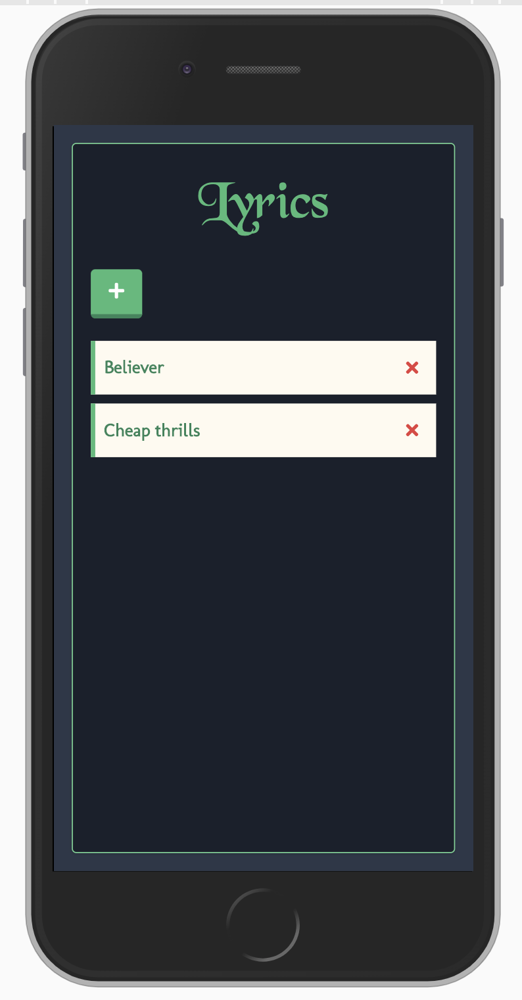
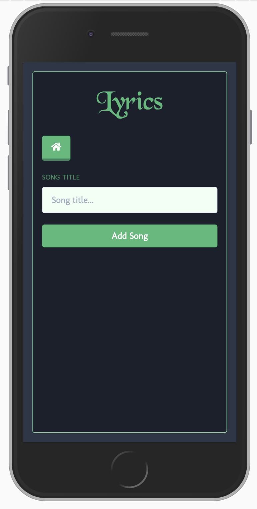
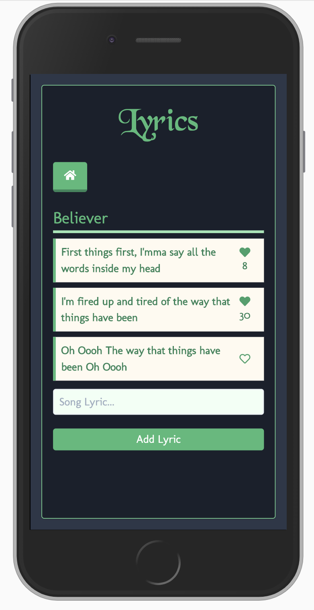

# Lyrics React-Graphql-Express Apps

This app is created to practice `React`, `GraphQL` and `Express`

### To start project

## Backend

1. Install packages - `npm install`
2. Before running project - Create `mongodb` URI and add that URI to root level `server.configs.js`
3. To run project - `npm run dev`
4. Graphql backend will run in `http://localhost:4000/graphql`

### Packages used

    * express
    * graphql
    * express-graphql
    * mongoose
    * cors
    * lodash

## Frontend

React client side project is bootstrapped with `create-react-app`

1. cd `client` and Install packages - `npm install`
2. To run project - `npm run dev`
3. React app will run in `http://localhost:3000`

### Packages used

    * react
    * react-apollo
    * react-router-dom
    * graphql
    * graphql-tag
    * apollo-boost
    * apollo-cache-inmemory
    * apollo-client

 

# App UI

|           Songs List Page            |          Add Song Page           |              Lyric Page              |
| :----------------------------------: | :------------------------------: | :----------------------------------: |
|  |  |  |

 
